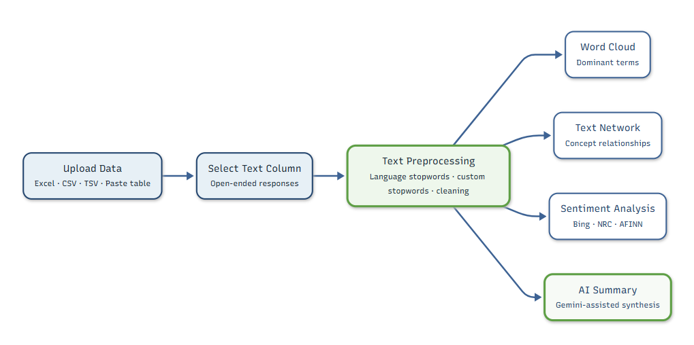
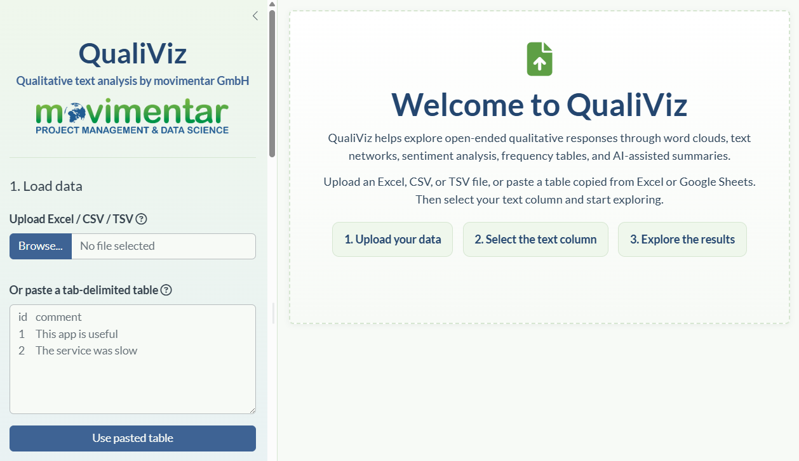
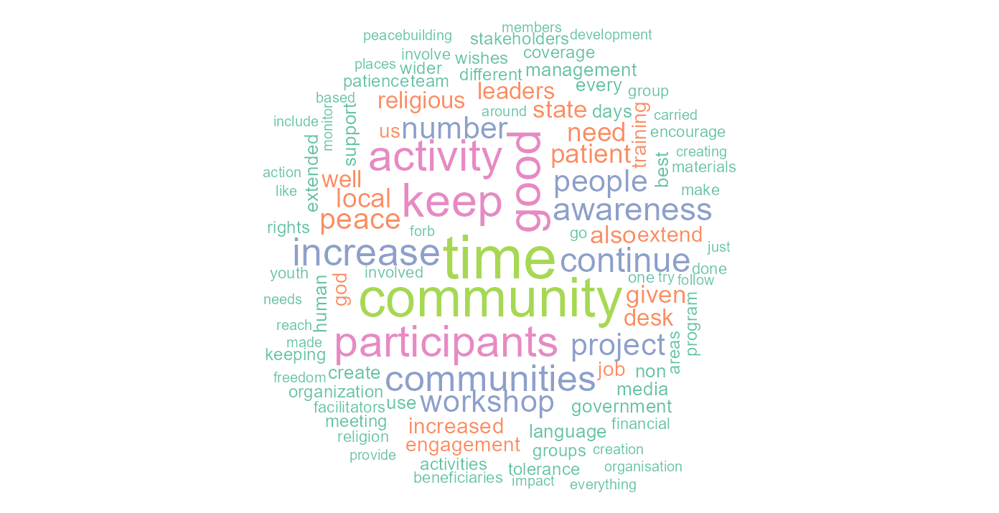
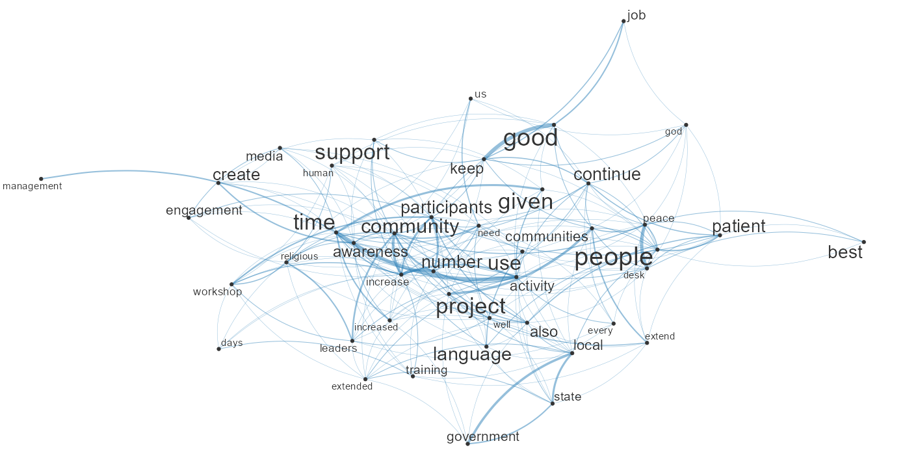
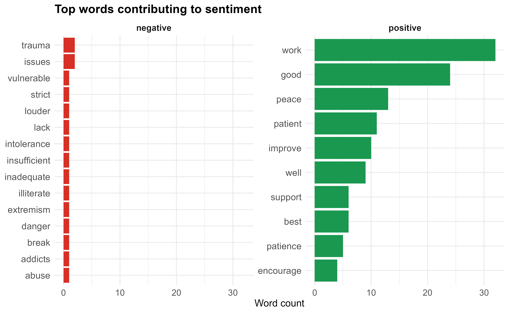
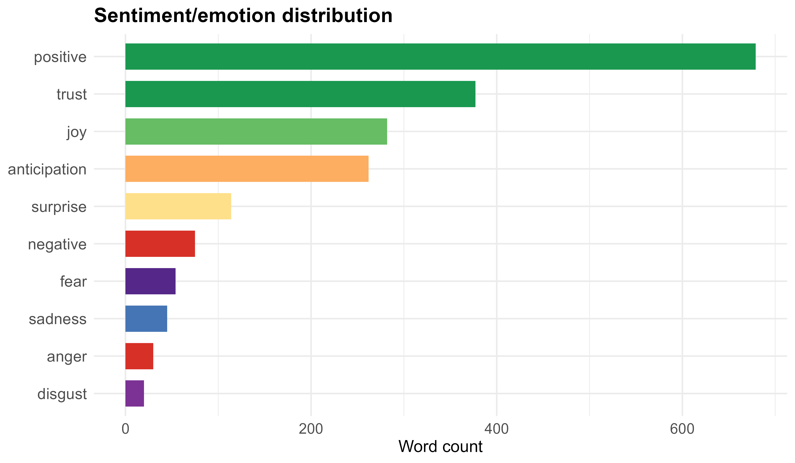
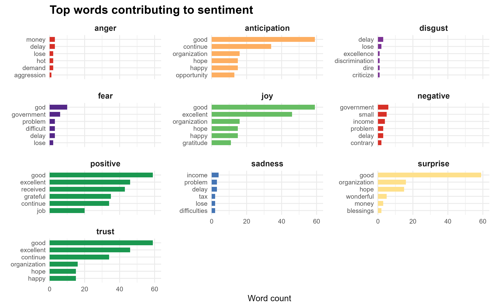
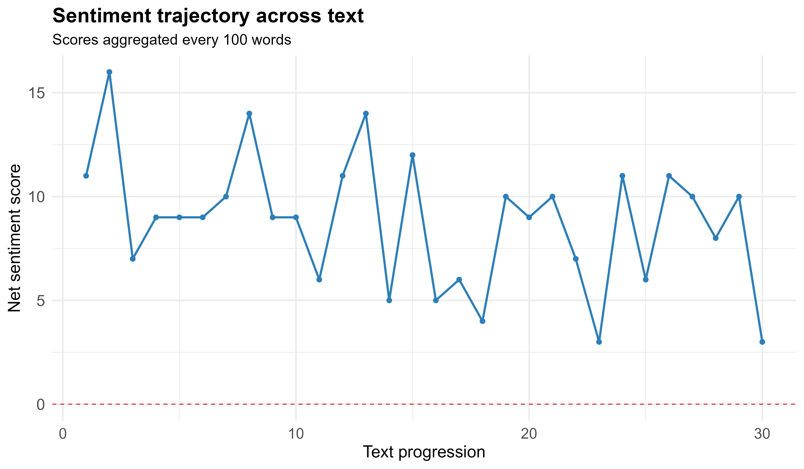

<p align="center">
  
</p>

<h1 align="center">QualiViz</h1>

<p align="center">
Transforming open-ended responses into actionable insights
</p>

<p align="center">

[](https://www.r-project.org/)
[](https://shiny.posit.co/)
[](LICENSE)
[](https://movimentar.shinyapps.io/qualiviz)
[](https://github.com/movimentar/qualiviz/issues)
[](https://github.com/movimentar/qualiviz/stargazers)
[](https://github.com/movimentar/qualiviz)
[](https://github.com/movimentar/qualiviz/issues)

</p>

**QualiViz** is an open-source Shiny application developed by **movimentar GmbH** to help researchers, evaluators, NGOs, humanitarian organisations, and social impact practitioners analyse open-ended qualitative data quickly, transparently, and responsibly.

---

# Quick Start

Run locally:

```r
source("prepare_lexicons.R")
shiny::runApp()
````

Or try the public deployment:

👉 [https://movimentar.shinyapps.io/qualiviz](https://movimentar.shinyapps.io/qualiviz)

---

# Overview

QualiViz helps transform qualitative responses into actionable insights through:

* Word frequency analysis
* Word clouds
* Text co-occurrence networks
* Sentiment analysis
* AI-assisted summaries

Supported inputs include:

* Excel files `.xlsx`, `.xls`
* CSV files
* TSV files
* KoboToolbox exports
* Direct copy-and-paste from Excel or Google Sheets

---

# Features

| Feature                   | Description                             |
| ------------------------- | --------------------------------------- |
| 📊 Word Clouds            | Explore dominant terms visually         |
| 🔗 Text Networks          | Discover relationships between concepts |
| 😊 Sentiment Analysis     | Bing, NRC, and AFINN lexicons           |
| 🤖 AI Summaries           | Gemini-assisted thematic synthesis      |
| 🌍 Multi-language Support | Automatic language-specific stopwords   |
| 📝 Frequency Tables       | Explore term counts and rankings        |
| 🎨 Custom Visualisation   | Colours, word counts, network controls  |
| 📥 Downloadable Outputs   | Export plots and tables                 |
| 🔒 Privacy-first Design   | No intentional storage of uploaded data |

---

# Workflow



---

# Screenshots and Example Outputs

## Main Interface



## Word Cloud



## Text Network



## Text sentiments



## Sentiment Distribution



## Sentiment Words



## Sentiment Trajectory



---

# Example Use Cases

QualiViz can be used for:

* KoboToolbox survey exports
* Community feedback mechanisms
* Focus group discussions
* Interview transcripts
* Workshop evaluations
* Training evaluations
* Learning and reflection exercises
* Humanitarian needs assessments
* Peacebuilding and social cohesion research
* Customer feedback analysis
* Open-ended survey responses

---

# Why QualiViz?

Qualitative data contains stories, perspectives, and lived experiences that are often difficult to analyse at scale.

QualiViz was created to help practitioners balance analytical rigour with human understanding. We believe technology should support listening, learning, and reflection while preserving the richness of human voices.

The project is shared openly in the spirit of collaboration, learning, responsible innovation, and improved human understanding.

---

# What QualiViz Provides

| Capability                  | Included |
| --------------------------- | -------- |
| Word frequency analysis     | ✓        |
| Word clouds                 | ✓        |
| Text co-occurrence networks | ✓        |
| Sentiment analysis          | ✓        |
| AI-assisted summaries       | ✓        |
| Multi-language stopwords    | ✓        |
| Downloadable outputs        | ✓        |
| Open source                 | ✓        |
| Free public deployment      | ✓        |

---

# Project Structure

```text
qualiviz/
├── app.R
├── prepare_lexicons.R
├── README.md
├── LICENSE
├── .gitignore
├── .Renviron.example
│
├── data/
│   └── .gitkeep
│
├── www/
│   ├── custom.css
│   ├── favicon.svg
│   ├── favicon-16.png
│   ├── favicon-32.png
│   ├── favicon-48.png
│   ├── favicon-192.png
│   ├── apple-touch-icon.png
│   └── movimentar-logo.png
│
└── README_files/
    ├── qualiviz_screenshot.png
    ├── qualiviz_wordcloud.png
    ├── qualiviz_text_network.png
    ├── qualiviz_textplot.png
    ├── qualiviz_sentiment_distribution.png
    ├── qualiviz_sentiment_words.png
    └── qualiviz_sentiment_trajectory.png
```

---

# Requirements

QualiViz is built using R and Shiny.

Main packages include:

* shiny
* bslib
* readxl
* readr
* dplyr
* stringr
* tibble
* DT
* ggplot2
* quanteda
* quanteda.textplots
* quanteda.textstats
* tidytext
* textdata
* httr2
* markdown
* memoise
* colourpicker
* RColorBrewer

---

# Installation

Clone the repository:

```bash
git clone https://github.com/movimentar/qualiviz.git
cd qualiviz
```

Install required packages:

```r
install.packages(c(
  "shiny",
  "bslib",
  "readxl",
  "readr",
  "dplyr",
  "stringr",
  "tibble",
  "DT",
  "ggplot2",
  "quanteda",
  "quanteda.textplots",
  "quanteda.textstats",
  "tidytext",
  "textdata",
  "httr2",
  "markdown",
  "memoise",
  "colourpicker",
  "RColorBrewer"
))
```

---

# Prepare Sentiment Lexicons

Run once before using or deploying the application:

```r
source("prepare_lexicons.R")
```

This creates local sentiment lexicon files:

```text
data/bing_lexicon.rds
data/nrc_lexicon.rds
data/afinn_lexicon.rds
```

Verify:

```r
list.files("data")
```

Expected output:

```text
afinn_lexicon.rds
bing_lexicon.rds
nrc_lexicon.rds
```

The generated `.rds` lexicon files are intentionally not tracked in Git.

---

# Environment Variables

Copy `.Renviron.example` to `.Renviron`:

```bash
cp .Renviron.example .Renviron
```

Then edit `.Renviron`:

```text
GEMINI_API_KEY=your_gemini_api_key
GA_MEASUREMENT_ID=G-XXXXXXXXXX
GEMINI_MODEL=gemini-2.5-flash
```

Do not commit `.Renviron`.

Recommended `.gitignore` entries:

```gitignore
.Renviron
.Renviron.*
!.Renviron.example
.Rhistory
.RData
.Ruserdata
.Rproj.user/
rsconnect/
data/*.rds
!data/.gitkeep
```

---

# Running Locally

```r
shiny::runApp()
```

or

```r
shiny::runApp("qualiviz")
```

---

# Deployment to shinyapps.io

Before deployment:

```r
source("prepare_lexicons.R")
```

Deploy:

```r
rsconnect::deployApp(
  appName = "qualiviz"
)
```

If deploying with local generated lexicon files and `.Renviron`, use an explicit deployment manifest:

```r
rsconnect::deployApp(
  appName = "qualiviz",
  appFiles = c(
    "app.R",
    ".Renviron",
    "prepare_lexicons.R",
    "LICENSE",
    "www/custom.css",
    "www/favicon.svg",
    "www/favicon-16.png",
    "www/favicon-32.png",
    "www/favicon-48.png",
    "www/favicon-192.png",
    "www/apple-touch-icon.png",
    "www/movimentar-logo.png",
    "data/bing_lexicon.rds",
    "data/nrc_lexicon.rds",
    "data/afinn_lexicon.rds"
  ),
  forceUpdate = TRUE
)
```

Do not commit `.Renviron` or generated lexicon files to GitHub.

---

# Privacy and Data Handling

QualiViz is designed to minimise data retention.

* Uploaded files are processed only during the active session.
* Generated visualisations are created in memory.
* The application does not intentionally store uploaded data.
* The application does not intentionally store AI summaries.
* The application does not intentionally store prompts sent to Gemini.
* Analytics are optional and activated only after user consent.

Users should avoid uploading personal, confidential, or sensitive information unless they are authorised to do so.

---

# Analytics and GDPR

QualiViz includes optional Google Analytics support.

After user consent:

* Page visits can be tracked.
* Tab usage can be tracked.
* Button interactions can be tracked.

The following are never intentionally sent to Google Analytics:

* Uploaded files
* Open-text responses
* Column names
* AI prompts
* AI outputs
* Visualisations

---

# Sentiment Analysis

QualiViz supports three sentiment approaches.

## Bing

Classifies words as:

* Positive
* Negative

## NRC

Classifies words into emotions:

* Anger
* Anticipation
* Disgust
* Fear
* Joy
* Sadness
* Surprise
* Trust
* Positive
* Negative

## AFINN

Assigns numeric sentiment scores.

---

# NRC Licence Notice

The NRC Word-Emotion Association Lexicon may require a separate licence for commercial use.

Please review the original NRC licensing terms before commercial deployment.

Reference:

Mohammad, S. M., & Turney, P. D. (2013). *Crowdsourcing a Word-Emotion Association Lexicon*. Computational Intelligence, 29(3), 436–465.

---

# AI Summary Feature

QualiViz can generate AI-assisted summaries using Google's Gemini API.

The feature is intended to:

* Support exploration
* Accelerate coding preparation
* Suggest themes
* Identify recurring topics

AI outputs should always be reviewed and interpreted by humans.

---

# Disclaimer

QualiViz provides exploratory qualitative analysis support.

Automated sentiment analysis and AI-generated summaries should not be considered definitive interpretations of qualitative data.

Human review and contextual interpretation remain essential.

---

# Roadmap

## Short-term

* Additional language support
* Interactive coding assistant
* PDF reporting

## Medium-term

* Topic modelling
* BERTopic integration
* Multi-document comparison

## Long-term

* Qualitative coding workflows
* Team collaboration features
* R package version

---

# Contributing

Contributions are welcome.

Typical workflow:

```bash
git checkout -b feature/my-feature
git add .
git commit -m "Add my feature"
git push origin feature/my-feature
```

Then open a Pull Request.

Areas where contributions are particularly welcome:

* Accessibility improvements
* Additional language support
* Visualisation enhancements
* Testing
* Documentation
* Performance optimisation

---

# Citation

If you use QualiViz in academic or professional work, please cite:

```text
movimentar GmbH (2025).
QualiViz: Open-source qualitative text analysis with R Shiny.
https://github.com/movimentar/qualiviz
```

---

# Support QualiViz

QualiViz is developed and maintained by movimentar GmbH.

If you would like to collaborate, request features, support deployment, or discuss custom solutions, please contact:

[https://movimentar.eu](https://movimentar.eu)

---

# License

This project is released under the MIT License.

See the LICENSE file for details.

---

# Contributors

* movimentar GmbH

---

Built with ❤️ by movimentar GmbH

Supporting responsible data use, learning, reflection, and improved human understanding through open-source technology.

[https://movimentar.eu](https://movimentar.eu)
